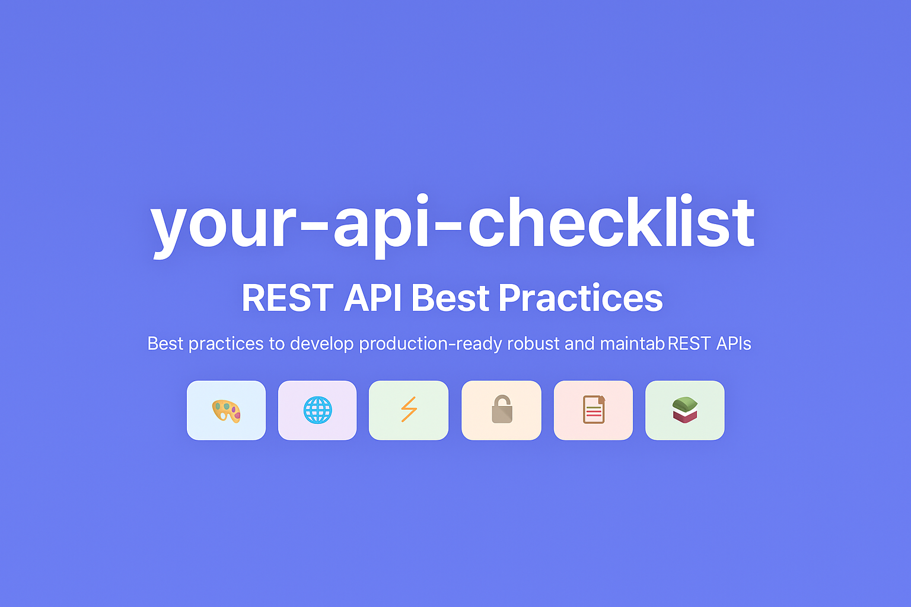

# Your API Checklist

<p align="center">
  
</p>

An interactive, comprehensive, and beautifully designed checklist for RESTful API best practices. Built for developers who want to design, test, and launch robust and maintainable APIs.

**[➡️ Live Demo](https://your-checklist.github.io/your-api-checklist.com/)**


## ✨ Features

- **📝 Comprehensive Checklist**: Over 15 carefully curated best practices covering the entire API lifecycle.
- **🗂️ Smart Categorization**: Items are grouped into logical categories like `Design`, `Security`, `Performance`, and `Documentation`.
- **🚀 Priority System**: Filter tasks by `High`, `Medium`, or `Low` priority to focus on what matters most.
- **📚 Rich Content**: Each item includes a detailed description, a practical example, and links to authoritative references.
- **💾 Persistent State**: Your progress is automatically saved to your browser's `localStorage`. No account needed.
- **📂 Multi-Project Management**: Create, switch between, and delete multiple projects, each with its own checklist state.
- **📊 Progress Tracking**: Visualize your progress with a main progress bar and per-category indicators.
- **🧭 Effortless Navigation**: Jump to any category instantly with both a horizontal quick navigation bar and a smart vertical navigation that appears as you scroll.
- **📤 Multiple Export Options**: Export your checklist to `Markdown`, `JSON`, or a print-friendly `PDF`.
- **📱 Fully Responsive**: A clean, modern, and mobile-friendly UI that works great on any device.
- **⭐ GitHub Integration**: See the project's star count directly in the app to encourage community engagement.

## 🚀 Getting Started

To run the project locally, follow these steps:

1.  **Clone the repository:**
    ```sh
    git clone https://github.com/your-checklist/your-api-checklist.com.git
    cd your-api-checklist.com
    ```

2.  **Install dependencies:**
    ```sh
    npm install
    ```

3.  **Run the development server:**
    ```sh
    npm start
    ```
    The app will open automatically at `http://localhost:3000`.

## 🤝 Contributing

Contributions, issues, and feature requests are welcome! We believe in the power of community to build and improve open-source tools.

Feel free to check the [issues page](https://github.com/your-checklist/your-api-checklist.com/issues) or read our [**Contributing Guide**](./CONTRIBUTING.md) to learn how you can get involved.

## ❤️ Acknowledgements

- Built with [React](https://reactjs.org/).
- Deployed on [GitHub Pages](https://pages.github.com/).

## 📄 License

This project is open source and available under the [MIT License](./LICENSE).
